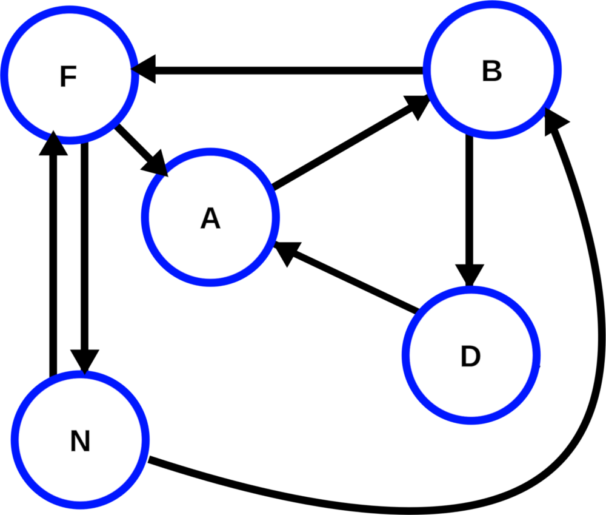
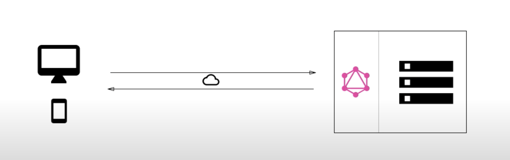
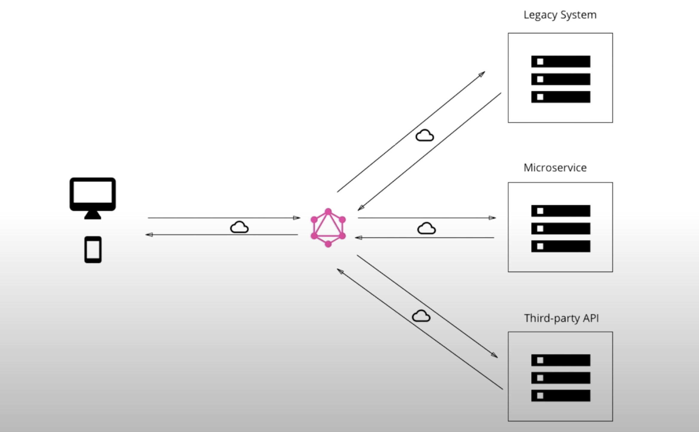
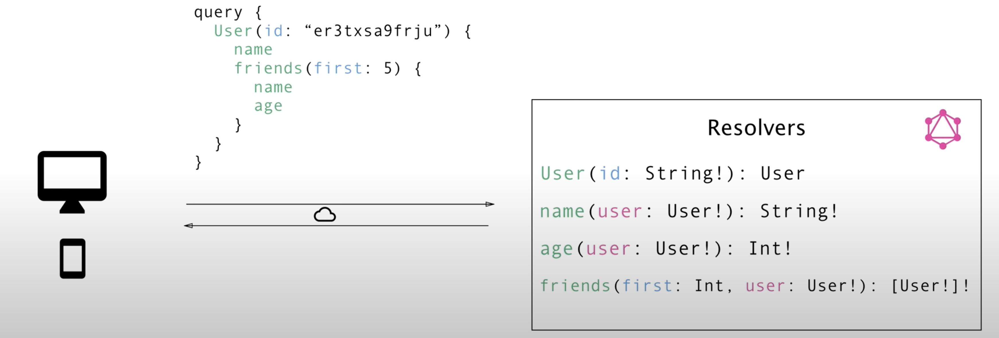

# GraphQL

## Query

```js
{
  pokemon(id: "1") {
    name,
    color
  }
}
```

## Result

```json
{
  "data": {
    "pokemon": {
      "name": "Pikachu",
      "color": "yellow"
    }
  }
}
```

## Prerequisite Knowledge

* Specification, not implementation

* Language agnostic

* Large amount of competition

</br>

---

</br>

# Graphs

A graph is a data structure - a specialized format for organizing and storing data. There are many kinds of data structures, some of which you are already familiar w/ like linked lists and binary search trees. Graphs are a simple and powerful data structure which consist of *nodes* and *edges*.

The formal definition of a graph is as follows:

```
A graph consists of a set of nodes and edges which connect pairs of nodes.
```

Although you might not realize it, you likely make use of graphs on a daily basis. Social networking sites such as Twitter or LinkedIn use graphs to model users and the relationships between them. In a path finding application such as Google Maps, intersections are represented as nodes while roads are represented as edges connecting the intersections. Graphs are also used in your computer's operating system to allocate resources to different processes.

Let's take a look at a simple graph which might represent users and follows on Twitter:



The set of nodes in this graph is `N = {F, A, N, B, D}`. The set of edges is `E = {FN, NF, FA, AB, BF, BD, DA, NB}`. The graph represented here is called a *directed graph* b/c each edge has a direction associated w/ it. This makes sense for an application like Twitter since, although user `F` follows user `A`, it does not necessarily mean that user `A` follows user `F`. This is different from an application like Facebook, where connected users are 'friends' of each other. In this case, the graph would be undirected and the edges would be drawn w/o arrows.

A *tree* is simply a directed graph w/ no cycles, meaning that you cannot trace a path from any node that leads back to itself. Trees are hierarchical data structures w/ a signature pyramid appearance:


## Graphs and GraphQL

Let's say you were building an application for an online store. A user visiting a product page would likely access it by ID. However, from this ID, we still need to access more data - product specifications, seller information, reviews, and so forth. Using a traditional REST API, this data would be aggregated by a cascade of many HTTP fetches to our backend.

The creators of GraphQL realized something important, which is that all of this contingent fetching can be represented as a tree. When we make a request to our server using GraphQL, we send this entire request tree to our backend instead of individual requests. This allows the server to fulfill all of our requests in one go, eliminating a large amount of unnecessary communication between the client and server.

GraphQL does not replace our database, and does not even necessarily replace our RESTful API. In fact, we can use GraphWL w/ any database, such as PostgreSQL or MongoDB. When adding GraphQL to an application, you as the developer will define the `Types` (nodes) and `Relationships` (edges) between the data in your application. We will still need access to our data through some API to tell GraphQL where the data is located. However, GraphQL will package these requests into a single request tree which will be fulfilled on the backend and returned in its entirety. Simply put, GraphQL is a query language that traverses your data graph to produce a query result tree. Later on, we'll learn how to cache our responses in the frontend to accelerate data fetching.

If this doesn't completely make sense to you right now, have no fear. The nature of the request tree will become clear as we begin to make GraphQL queries in the upcoming sections.

</br>

---

</br>

# RESTful Routing

In this section we will review the conventions of RESTful routing and discuss some of the associated drawbacks. Even if you have utilized a REST API in the previous projects, it will be helpful to refresh your memory and discuss the reasons we might choose to augment our API w/ GraphQL.

## What is REST?

REST (Representational State Transfer) is an architecture style for designing networked applications. Typically associated w/ HTTP requests, developers can utilize REST architecture in their project w/o installing additional libraries or additional software. The request methods and data type are decoupled, meaning that REST has the ability to return many different data formats such as JSON, XML, and YAML.

REST is defined by 6 architectural constraints:

* **Uniform interface**: Individual resources are identified w/ URLs. The resources in the database are in a different form than the data returned to the client, and the client can modify the resources if given permission. Messages communicated between the client and server are self-descriptive and include enough information to process the request. When a developer is familiar w/ one of your APIs, they should be able to follow a similar approach for your other APIs.

* **Client-server**: The client and the server are decoupled, allowing them to evolve separately w/o any dependence on one another.

* **Stateless**: Information from requests not stored on the server. Each and every request is treated individually, w/ no dependence on prior requests. The client is responsible for managing the state of the application rather than the server, meaning that each request must contain the necessary information to fulfill the request, including authorization details.

* **Cacheable**: Caching should be applied to resources when applicable to improve application performance. Responses must define themselves as cacheable (or not) to prevent the client from sending extraneous data in response to subsequent requests.

* **Layered system**: The client cannot tell whether it is connected directly to the end system or to some intermediary → helps to enforce security and enables scalability via load balancing.

* **Code on demand**: An optional constraint which allows the server to return executable code.

In practice, RESTful routes enable a simple-to-understand API for accessing and modifying data using HTTP methods - `GET`, `POST`, `PUT`, `DELETE`, and `PATCH`. For example, if we wished to retrieve all of the products on an online store for a given category, we would make a `GET` request to an endpoint that looks something like:

```
http://shopurl.com/api/categories/20/products
```

This URL is easily read by a human, making the API developer friendly. Even if we keep adding parameters to the URL string, it is still reasonably simple to tell what kind of information we are after:

```
http://shopurl.com/api/categories/20/products/112/reviews/10/replies?_positive=true
```

The flexibility and data-agnostic nature of RESTful architecture has allowed it to grow and evolve w/ the web, enabling feature rich and developer friendly applications. However, problems have arisen w/ the architecture in recent years as the web has grown to accommodate a growing number of mobile users, who typically use the Internet to access applications which are not only data-rich, but must also have access to constantly changing data.

## Limitations of REST

### Repeated Queries

REST architecture is still very useful for applications w/ segmented resources. However, in modern applications, much of the data we need to access is **highly relational**. In the last section we learned how to represent a graph w/ nodes and edges. If we think of the information in our database as a graph, a highly relational database is one w/ a large number of edges compared to the number of nodes.

Fetching highly relational data w/ a REST API often involves repeated requests to the backend. In our online store example, suppose we had a list of products fow which we would like to return a list of comments. In order to do so we would need to iterate over the list of products and make a separate request for each one (an N + 1 query). We could, of course, add a RESTful endpoint to our application which takes a list of products and returns a list of comments. However, this results in a highly specialized endpoint for a single use case. If we have many connected resources in our application, we could potentially end up w/ hundreds of such specialized endpoints:

```
http://shopurl.com/api/product_comments
http://shopurl.com/api/product_categories
http://shopurl.com/api/user_replies
...
```

This breaks our REST convention and results in an API schema which is very difficult to utilize as a developer.

### Over fetching

When we make a RESTful request for some resource, we return all of the information on that resource - even that which we don't need. For example, let's say we wanted to generate a list of customer names and email addresses for vendors on our online shop so that they can add them to an email list. Querying `http://shopurl.com/api/users/:id` would return something like:

```json
{
    "id": 564,
    "name": "Paul Allen",
    "email": "paul@paulallen.com",
    "address": "1234 TMI Lane",
    "city": "Seattle",
    "state": "WA",
    "zip": "98145",
    "company": "Microsoft",
    "favorites": [
        { "id": 34, "name": "Sponge Bob temporary tattoo (pack of 24)" },
        { "id": 147, "name": "12th Man bumper sticker" },
        { "id": 42, "name": "Hitchhiker's Guide to the Galaxy" },
        ...
    ],
    ...
}
```

Although we really only needed each user's name and email address, our database retrieves a vast swath of unnecessary information which we will not end up using. Perhaps we could make another, specialized endpoint which returns only the information we require. However, if we repeated this strategy every time we ran into this scenario, the documentation for our API would quickly become ridiculous and overwhelming.

### Thin Client / Fat Server

Although the server and client are decoupled w/ REST, their relationship is unbalanced. The bulk of the processing is dependent on the server, which does all of the heavy lifting. This means that the client has very little control over the data returned to it and is limited by the endpoints exposed by the server. This made sense in the past when user devices were slow and unreliable. However, in recent years, devices have become more powerful in terms of processing power. It is difficult to take advantage of this power using a REST API.

## Advantages of GraphQL

### Single Request / Single Response

Perhaps the biggest advantage of GraphQL is that queries are packaged into a single request to the backend. This makes data delivery more efficient and grants more power to the client.

Let's say you would like to return a list of reviews for a single product's related products. That endpoint would look something like:

```
http://shopurl.com/api/products/34/related/reviews
```

Imagine writing the controller for this endpoint. You would first have to iterate through the list of each of the product's relatives to fetch their review IDs. Then, you would iterate through the list of review IDs to fetch information on each review. Using GraphQL, these queries would be bundled into a single request to the backend w/ the data returned as a single response.

### Relevant Data Fetching

When we make a query w/ GraphQL, we specify exactly which data we would like to return from the server. This means that we never over fetch data. Besides of increased efficiency, this results in easier data manipulation on the frontend.

### Server Client Balance

Since we can tailor each query to our needs, GraphQL gives power back to the client. This increases functionality on the client side and reduces the burden on the server, leveling the relationship between server and client.

## Conclusion

RESTful architecture has catalyzed the growth of the Internet, but lends itself to segmented, non-relational data. However, as new applications increasingly necessitate highly connected data, the traditional practices of REST can become messy and confusing. GraphQL enables us to model the relationships between our data as a graph and specify the relationships between data types. This allows us to make fewer and more efficient requests retrieving only the data we need for each particular use case.

</br>

---

</br>

# JSON

Server responses in GraphQL are returned in JSON format. JSON (JavaScript Object Notation) is a self describing, data interchange format designed to be easily parse-able by both humans and machines. It is based on the JavaScript language, and quickly gained prominence to replace XML as the standard data interchange format on the web. Data exchanged between a browser and server must be text, and JSON consists only of text. Any JavaScript object can easily be converted to JSON w/ built-in methods, and vice versa.

The syntax of JSON is very simple to follow:

* Data is in name/value pairs

* Data is separated by commas

* Curly braces hold objects

* Square brackets hold arrays

* String values must be written w/ double quotes

Let's take a look at an example of a JSON object:

```json
{
  "name": "Jeff Bezos",
  "age": 55,
  "children": 4,
  "height": 5.6,
  "wealth": 137000000000,
  "commendations": ["National Merit Scholar", "Silver Knight Award"]
}
```

We can also nest JSON data as deeply as we would like:

```json
{
    "name": "Jeff Bezos",
    "age": 55,
    "children": 4,
    "height": 5.6,
    "wealth": 137000000000,
    "commendations": ["National Merit Scholar", "Silver Knight Award"],
    "companies": {
        "Amazon": {
            "founded": 1994,
            "description": "Online marketplace",
            "missionStatement": "Our vision is to be earth's most customer-centric company; to build a place where people can come to find and discover anything they might want to buy online."
        },
        "blueOrigin": {
            "founded": 2000,
            "description": "Space travel",
            "missionStatement": "We're committed to building a road to space so our children can build the future."
        }
    }
}
```

You must convert your JSON object to JavaScript before you can make use of the data:

```js
let myJSON = '{"name": "Dr. Seuss", "books": ["Green Eggs and Ham", "Fox in Socks", "Horton Hears a Who!"]}';

let myObj = JSON.parse(myJSON);

console.log(myObj);

// >> {name: "Dr. Seuss", books: ["Green Eggs and Ham", "Fox in Socks", "Horton Hears a Who!"]}
```

Now you can manipulate your data as you would any other JavaScript object.

We also need to convert a JavaScript object before we can send it to the server:

```js
let myObj = {name: "Dr. Seuss", books: ["Green Eggs and Ham", "Fox in Socks", "Horton Hears a Who!"]};

let myJSON = JSON.stringify(myObj);

console.log(myJSON);

// >> '{"name":"Dr. Seuss","books":["Green Eggs and Ham","Fox in Socks","Horton Hears a Who!"]}'
```

We'll get a lot of practice using JSON in the upcoming sections. Just keep in mind that a JSON object is not a JavaScript object, but that we can easily coerce JavaScript objects to JSON in order to send information through HTTP requests.

</br>

---

</br>

# GraphQL Architecture

## Architectural Use Cases

1. GraphQL server *with a connected database*

  + often used for *greenfield projects*

  + uses single web server that implements GraphQL

  + server resolves queries and constructs response w/ data that it fetches from the database



2. GraphQL server to *integrate existing system*

  + compelling use case for companies w/ legacy infrastructures and many different APIs

  + GraphQL can be used to *unify* existing systems and hide complexity of data fetching logic

  + the server works w/ any data source (databases, web services, 3rd party APIs, ...)



3. *A hybrid approach* with a *connected database* and *integration of existing system*


GraphQL is transport layer agnostic → can be used w/ any available network protocol (TCP, WebSockets). GraphQL works w/ any database or data format.

## *Resolver* Functions

* GraphQL queries/mutations consist of a set of *fields*

* GraphQL server *has one `resolver function` per field*

* the purpose of each resolver is to retrieve the data for its corresponding field



## GraphQL Clients

* GraphQL is great for frontend developers as data fetching complexity can be pushed to the server-side

* client doesn't care where data is coming from

* opportunity for *new abstractions* on the frontend

### From imperative to declarative data fetching

#### **Imperative Data Fetching**

1. Construct and send HTTP request (e.g. with fetch in JavaScript)

2. Receive and parse server response

3. store data locally (in memory or persisted)

4. display information in the UI

#### **Declarative Data Fetching**

1. Describe data requirements

2. Display information in the UI

3. store data locally (in memory or persisted)

4. display information in the UI

</br>

---

</br>

# Basic Queries

GraphQL Root query example:

```js
query findLuke {
  person(id: "cGVvcGx1OjE=") {
    name,
    eyeColor,
    mass
  }
}
```

```json
{
  "data": {
    "person": {
      "name": "Luke Skywalker",
      "eyeColor": "blue",
      "mass": 77
    }
  }
}
```

</br>

---

</br>

# Inline Fragments and Interfaces

## Interfaces

The GraphQL type system supports interfaces, an abstract type that include a certain set of fields that a type must include to implement the interface. This is best explained by an example.

Suppose we are writing a GraphQL application to display information on characters in the Harry Potter universe. We might have different GraphQL types to account for the different types of beings in our universe - let's say `Muggles` and `Wizards`. However, when we query for a character, we might simply want to look up a `Character` by ID or name instead of having to be specific about their magical ability. In this case, we would define an interface:

```js
interface Character {
  id: ID!
  name: String!
}
```

Then, we can use our newly created interface to define our `Muggle` and `Wizard` types:

```js
type Muggle implements Character {
  id: ID!
  name: String!
}

type Wizard implements Character {
  id: ID!
  name: String!
  house: [House]!
}
```

As you can see, each type has all of the fields specified by `Character`, but the `Wizard` type adds its own field - `house` - to its definition. Now we can return a generic `Character` when we query for an individual from the frontend, by we're going to run into some trouble w/ this custom field. We can solve this w/ an inline fragment.

## Implementing Inline Fragments

Let's imagine we are writing this query to find a character by ID. It would look something like:

```js
query FindCharacter {
  character(id: 117) {
    name
    house
  }
}
```

Running this query would result in an error:

```
"Cannot query field \"house\" on type \"Character\". Did you mean to use an inline fragment on \"Wizard\"?",
```

Since the `character` field returns a generic character, GraphQL may be querying either for a `Muggle` or a `Wizard` depending on the argument. The problem is the `house` field - we are only allowed to query for fields listed on the `Character` type.

So, how do we access the house information when we query for a wizard? We can solve this problem w/ an inline fragment:

```js
query FindCharacter {
  character(id: 117) {
    name
    // this allow us to only get house information if this character is a Wizard
    ... on Wizard {
      house
    }
  }
}
```

Now, since we have specified that we should only return the `house` field for `Wizard` types, we can run our query and retrieve the expected data.

</br>

---

</br>

# Nested Queries

```js
query findLuke {
  person(id: "cGVvcGx1OjE=") {
    name,
    eyeColor,
    mass,
    species {
      name,
      classification,
      averageHeight
    },
    homeworld {
      name,
      diameter,
      population
    }
  }
}
```

```json
{
  "data": {
    "person": {
      "name": "Luke Skywalker",
      "eyeColor": "blue",
      "mass": 77
    },
    "species": {
      "name": "Human",
      "classification": "mammal",
      "averageHeight": 180
    },
    "homeworld": {
      "name": "Tatooine",
      "diameter": 10465,
      "population": 200000
    }
  }
}
```

</br>

---

</br>

# Variables and Directives

Query:

```js
query findPerson($id: ID, $withSpecies: Boolean!) {
  person(id: $id) {
    name,
    eyeColor,
    mass,
    species @include(if: $withSpecies) { // @skip is another Directive
      name,
      classification,
      averageHeight
    },
    homeworld {
      name,
      diameter,
      population
    }
  }
}
```

Query Variables:

```js
{
  "id": "cGVvcGxlOjE=",
  "withSpecies": false
}
```

Query Result:

```json
{
  "data": {
    "person": {
      "name": "Luke Skywalker",
      "eyeColor": "blue",
      "mass": 77
    },
    "species": {
      "name": "Human",
      "classification": "mammal",
      "averageHeight": 180
    },
    "homeworld": {
      "name": "Tatooine",
      "diameter": 10465,
      "population": 200000
    }
  }
}
```

</br>

---

</br>

# Aliases and Fragments

```js
query ComparePlanets($withTerrains: Boolean!) {
  tatooine: planet(id: "cGxhbmV0czox") {
    ...FindPlanet
  },
  alderaan: planet(id: "cGxhbmV0czoy") {
    ...FindPlanet
  }
}

fragment FindPlanet on Planet {
  name,
  diameter,
  gravity,
  population,
  climates,
  terrains @include(if: $withTerrains)
}
```

Query variables:

```js
{
  "withTerrains": false
}
```

```json
{
  "data": {
    "tatooine": {
      "name": "Tatooine",
      "diameter": 10456,
      "gravity": "1 standard",
      "population": 200000,
      "climates": [
        "arid"
      ],
      "terrains": [
        "desert"
      ]
    },
    "alderaan": {
      "name": "Alderaan",
      "diameter": 12500,
      "gravity": "1 standard",
      "population": 200000000,
      "climates": [
        "temperate"
      ],
      "terrains": [
        "grasslands",
        "mountains"
      ]
    }
  }
}
```

</br>

---

</br>

# Mutations Introduction

When developers discuss GraphQL, they usually do so in terms of data fetching. So far, we have only learned how to read information from the database. Since it's pretty likely that you'll also want to create, update, and destroy records, you'll need to learn how to write mutations.

The syntax for a mutation is straightforward:

```js
mutation {
  mutationName(key1: "val1", key2: "val2", ...) {
    // These arguments specify the information to be returned from the backend
    key1,
    key2,
    association {
        id,
        name,
        ...
    }
  }
}
```

When we write queries, we can just use a pair of curly braces - we don't necessarily need to specify the query type. However, when using mutations, as you can see on the first line of the snippet above, we must define that we are using a mutation so that GraphQL knows what we are trying to do. Though just like queries, we can name our mutations anything we like.

</br>

---

</br>

# Object & Scalar Types

In GraphQL, there are two different kinds of types.

1. `Scalar` types represent concrete units of data. The GraphQL spec has five predefined scalars: as `String`, `Int`, `Float`, `Boolean`, and `ID`.

2. `Object` types have fields that express the properties of that type and are composable. Examples of object types are a `User` or `Post`, and all the the resources your project may have.

In every GraphQL schema, you can define your own scalar and object types. An often cited example for a custom scalar would be a `Date` type where the implementation needs to define how that ype is validated, serialized, and deserialized.

</br>

---

</br>

# Connecting Express to GraphQL

## ExpressGraphQL

The simplest way to run a GraphQL API server is to use Express. You will need to install two additional dependencies to your Express application: `express-graphql` and `graphql`. The Express middleware `express-graphql` allows us to quickly and easily setup a GraphQL HTTP server on to an HTTP endpoint (usually called "/graphql"). Once it is configured, `express-graphql` will allow us to define a GraphQL schema and spin up the GraphiQL interface which we can use to write test queries on our database.

## Configuration

As a reminder GraphQL does not replace your backend or server or any of the essential parts of your application. GraphQL will make up just one small piece of your application.

Below is a very simple example setting up a server using Express and the `express-graphql` package:

```js
const express = require('express');
const app = express();
// note the capitalization!
const expressGraphQL = require('express-graphql');

// This adds an additional step to see if the incoming request is intended for the graphql route.
// If it is -  that request is handed off to GraphQL. GraphQL will take care of the request
// before handing the response back to Express.
app.use('/graphql', expressGraphQL({
  // this allows us to use the GraphiQL tool to make queries against our development environment
  graphiql: true,
}));

app.listen(5000, () => {
  console.log('Running a GraphQL API server at localhost:5000/graphql');
});
```

This simple setup will return an error: `GraphQL middleware options must contain a schema`. Right now the only argument we passed in the `expressGraphQL` middleware was `graphql: true`. This error is letting us know that when we setup our `expressGraphQL` middleware on the '/graphql' route we *need* to include a `schema` argument. We'll be covering GraphQL schemas more in depth in a minute - but for now what we need to know is that the schema is how GraphQL knows how to enter your database yo get the information it needs.

So let's fix our error! We'll utilize the `buildSchema` function for this small example. Though in the future you'll be creating much more complex schemas for your applications using the `GraphQLSchema` object directly. Here is the setup for creating a schema and connecting it to GraphQL:

```js
const expressGraphQL = require('express-graphql');
const graphql = require('graphql');
// we are requiring graphql here because we need it for the buildSchema function.
const { buildSchema } = graphql;

// The buildSchema function can take in a string and outputs a GraphQLSchema object
const schema = buildSchema(`
  type Query {
    hello: String
  }
`);

// We are only including the root resolver for this demonstration to get a response without having a backend
const root = {
  hello: () => {
    return 'Hello world!';
  },
};


app.use('/graphql', expressGraphQL({
  graphiql: true,
  // register our schema
  schema: schema,
  // here we setup the root to have our response without a backend
  rootValue: root
}));
```

Here is what it looks like when we put it all together!

```js
const express = require('express');
const expressGraphQL = require('express-graphql');
const { buildSchema } = require('graphql');

// Construct a schema, using GraphQL schema language
const schema = buildSchema(`
  type Query {
    hello: String
  }
`);

// The root provides a resolver function for each API endpoint
const root = {
  hello: () => {
    return 'Hello world!';
  },
};

const app = express();
app.use('/graphql', expressGraphQL({
  schema: schema,
  rootValue: root,
  graphiql: true,
}));

app.listen(5000, () => {
  console.log('Running a GraphQL API server at localhost:5000/graphql');
});
```

Now if we start up the server and head to `localhost:5000/graphql` and query for `hello`:

```
{
  hello
}
```

You'll get the response of:

```json
{
  "data": {
    "hello" : "Hello world!"
  }
}
```

Meaning that everything worked! We successfully hooked up GraphQL to our Express server.

</br>

---

</br>

# GraphQL Schemas

The schema of a GraphQL application is the very heart of configuring GraphQL inside your application. The schema file contains all the knowledge for telling GraphQL exactly what your application data looks like, including what properties your data has, and how those properties relate to each other.

The `graphql/type` module is responsible for defining GraphQL types and schema. You can import from either the `graphql/type` module, or from the root `graphql` module itself. Since you've worked w/ a GraphQL query before, you know that the GraphQL query language is all about selecting fields on objects (like selecting the `name` field from a User). The most basic components of a GraphQL schema are object types, which represent a kind of object you can fetch from your database, and what fields it has on it. Most of the types in your schema will be object types.

In the example below we will be creating the schema for an application that just has Users. Users will have an `id`, a `name`, and a `favoriteNumber`. In order to connect GraphQL to our User we first need to inform GraphQL where out user lives, and the data the User has attached to it. We do this by creating a `GraphQLObjectType` which tells GraphQL what a user looks like.

```js
// schema.js

const graphql = require("graphql");
// capitalization is important!
const { GraphQLObjectType, GraphQLString, GraphQLInt } = graphql;

// By creating a GraphQLObjectType we are telling GraphQL what a user looks like.
const UserType = new GraphQLObjectType({
  // the name property describes the type we are defining.
  // Since we are defining a UserType the name will be UserType.
  name: "UserType",
  // fields is THE MOST important property - it refers to everything this Type will be able to return to you.
  // Which means all of the data associated with this type in the database.
  // If you don't have a field then you don't have returned data.

  //For our User the fields are id, name, and favoriteNumber.
  fields: {
    // we have to tell GraphQL what type of data each of these fields
    // returned from the database are.
    id: { type: GraphQLString },
    name: { type: GraphQLString },
    favoriteNumber: { type: GraphQLInt }
  }
});
```

## Root Queries

Awesome we've described what a User looks like - but GraphQL still doesn't know how to enter our database and get to our Users. GraphQL has no *entrypoint* into our data yet. We can solve this by writing a `Root Query`. The GraphQL docs describe a Root Query as "a type that represents all of the possible entry points into the GraphQL API". The Root Query is what allows us to jump into the graph of data we are now in the middle of creating.

Every root query will have a *resolve* function which will tell GraphQL how to execute that Root Query. Meaning, the resolve function will be where we tell GraphQL how to get data from our database. Like its name, `resolve` is meant to *resolve* a query by telling GraphQL where to find data.

It'll make more sense when we put it into action:

```js
// we are using lodash for this example because of the nifty find function
const _ = require("lodash");

// since we don't have a database setup yet we'll hardcode
// some data to be fetched here:
const users = [
  { id: "5", name: "Jet", favoriteNumber: 5 },
  { id: "7", name: "Spike", favoriteNumber: 17 }
];

const RootQuery = new GraphQLObjectType({
  name: "RootQueryType",
  /* The purpose of the root query is to land on a specific node in our graph */
  fields: {
    /* So we are telling GraphQL if a query is looking for a 'user' we will be 
    returning the UserType we just created. */
    user: {
      type: UserType,
      /* Args is short for arguments → letting GraphQL know that the following 
      arguments will be passed in with this query. */
      args: { id: { type: GraphQLString } },
      /* The resolve function will take in the `parentValue` and the arguments 
      being passed the original query. Ignore parentValue for now. */
      resolve(parentValue, args) {
        /* Use Lodash's `find` to walk through our users to find the first user 
        with the id we passed in. */
        return _.find(users, { id: args.id });
      }
    }
  }
});
```

Now that we have a Root Query setup you can create a `GraphQLSchema`. A `GraphQLSchema` takes in a Root Query and returns a `GraphQLSchema` instance.

The implementation for this is pretty simple:

```js
/* Add our GraphQLSchema to the list of things we are importing */
const { GraphQLObjectType, GraphQLString, GraphQLInt, GraphQLSchema } = graphql;

/* Below we are creating a new Schema instance using the Root Query above. 
We want to make sure we export our Schema. Then we can later import it into 
our `expressGraphQL` middleware */
module.exports = new GraphQLSchema({
  query: RootQuery
});
```

The final step is to input your exported Schema into your `expressGraphQL` middleware:

```js
// server/index.js
const express = require("express");
const expressGraphQL = require("express-graphql");
const schema = require("./schema");

const app = express();

/* Then we just have to register our schema with the expressGraphQL middleware */
app.use(
  "/graphql",
  expressGraphQL({
    schema: schema,
    graphiql: true
  })
);

app.listen(5000, () => {
  console.log("Running a GraphQL API server at localhost:5000/graphql");
});
```

There you have it! We can test this by heading to `localhost:5000/graphql` and
entering something like the following query:

```js
{
	user(id: "5") {
	  id
    name
    favoriteNumber
	}
}
```

We've just covered the basics of how to setup a GraphQL schema and connect it to Express. The general flow you'll follow going forward is that you'll create a `Type` for each of the tables in your database and then create `fields` in the `rootQuery` to be able to access those types. Here is a GraphQL [cheatsheet](https://devhints.io/graphql) for further reference on schema syntax.

</br>

---

</br>

# Writing Mutations

When ppl talk about GraphQL they usually talk about how data is fetched in queries. However, any complete data platform needs a way to modify server-side data as well. GraphQL can modify our database through the use of `mutations`.

Let's assume we already have our User type, Root type and schema already set up:

```js
//schema/user_type.js
const graphql = require("graphql");
const { GraphQLObjectType, GraphQLString, GraphQLInt } = graphql;

const UserType = new GraphQLObjectType({
  name: "User",
  fields: {
    id: { type: GraphQLString },
    name: { type: GraphQLString }
  }
});
```

Now we can query for a user but don't yet have a way to add one through GraphQL. Writing a mutation is very similar to writing a root query type. We define the arguments to be passed into the mutation, then write a resolve function to access the required information from the server.

```js
// schema/mutations.js
const graphql = require("graphql");
const { GraphQLObjectType, GraphQLString } = graphql;

const UserType = require("./user_type");
const User = mongoose.model("user");

/* Our mutations are still configured in the fields of a GraphQLObjectType */
const mutation = new GraphQLObjectType({
  /* Set the name to be indicative that this GraphQLObject will contain mutations */
  name: "Mutation",
  fields: {
    /* `newUser` will be the name of this mutation */
    newUser: {
      /* This mutation will create a new user so it will be of the User type */
      type: UserType,
      args: {
        /* Since we *need* the name argument to make a new user, we'll make this 
        argument GraphQLNonNull */
        name: { type: new GraphQLNonNull(GraphQLString) }
      },
      /* The resolve function will tell GraphQL how to run this mutation, in 
      this case, telling GraphQL to save this new User to our database */
      resolve(parentValue, { name }) {
        // this would just be the mongoose model `save` function
        return new User({ name }).save();
      }
    }
  }
});
```

Although our resolve functions may become more complex for further mutations, the basic syntax will remain the same.

Any mutations you write will need to be added to your `GraphQLSchema` instance when it is created. All we have to do is add our mutations to your schema like so:

```js
// schema/schema.js
const graphql = require("graphql");
const { GraphQLSchema } = graphql;

const RootQueryType = require("./root_query_type");
const mutations = require("./mutations");

// add our mutations to the Schema
module.exports = new GraphQLSchema({
  query: RootQueryType,
  mutation: mutations
});
```

Then to run our mutation we could go to GraphiQL and run the following:

```js
/* Need to tell GraphQL we are running a mutation. */
mutation {
  /* The name of the mutation we just created. */
  newUser(name:"name") {
    id,
    name
  }
}
```

That's it! You create your mutations in a `GraphQLObjectType`, w/ a name and fields, each field being a mutation. Each mutation will need the type of data they are mutating (the User type in this case), the arguments for what is being changed in the database, and the resolve function that will tell GraphQL how to execute the mutation.

There's one more important distinction between queries and mutations: While query fields are executed in parallel, mutation fields run in a series, one after the other.

This means that if we send two `addUser` mutations in one request, the first is guaranteed to finish before the second begins.

</br>

---

</br>

# Resolving Circular Queries

When defining GraphQL types, it's common to run into situations when two types reference each other. This is a problem b/c one type will be undeclared or undefined when the other is evaluated.

## Circular References in GraphQL Type Definitions

```js
// Bad, `Item` is not defined (JavaScript actually means *undeclared* here)
const User = new GraphQLObjectType({
  name: 'User',
  fields: {
    id   : { type: GraphQLString },
    email: { type: GraphQLString },
    items: {
      type: new GraphQLList(Item),
      resolve: () => { /* resolve function to get user's items */ }
    },
  }
})

const Item = new GraphQLObjectType({
  name: "Item",
  fields: {
    id:        { type: GraphQLString },
    name:      { type: GraphQLString },
    user: {
      type: User,
      resolve: () => { /* resolve function to get user of item */ }
    }
  }
})
```

```js
// doesn't work either - `Item` is undefined, but `type` expects a GraphQL type
let Item // declared, but has value of undefined
const User = new GraphQLObjectType({
  name: 'User',
  fields: {
    id   : { type: GraphQLString },
    email: { type: GraphQLString },
    items: {
      type: new GraphQLList(Item),
      resolve: () => { /* resolve function to get user's items */ }
    },
  }
})

Item = ...
```

To fix this, the reference JavaScript implementation allows us to **indicate the fields using a function that returns an object, instead of a plain object**. This function is lazily evaluated during runtime, so we will not run into problems w/ the interpreter.

```js
// Works!
const User = new GraphQLObjectType({
  name: 'User',
  fields: () => ({
    id   : { type: GraphQLString },
    email: { type: GraphQLString },
    items: {
      type: new GraphQLList(Item),
      resolve: () => { /* resolve function to get user's items */ }
    },
  })
})

const Item = new GraphQLObjectType({
  name: "Item",
  fields: () => ({
    id:        { type: GraphQLString },
    name:      { type: GraphQLString },
    user: {
      type: User,
      resolve: () => { /* resolve function to get user of item */ }
    },
  })
})
```

</br>

---

</br>

# Promises 

Promises are a tool for simplifying callbacks to asynchronous functions. Since the introduction of ES6, they have been included natively in Javascript.

## The Problem

Sometimes we need to chain several asynchronous functions. For example, maybe we want to get our user's geolocation, then hit an API to `GET` the user's nearest surf spot, then hit a third API to get the surf conditions for that spot.

```js
function getForecastForLocation(){
  locationRequest({
    success: spotRequest({
      success: forecastRequest({
        success: handleSuccess,
        error: handleError
      }),
      error: handleError
    }),
    error: handleError
  });
}
```

We would have to define the success callback of one function to invoke the next, and each would have to handle its own errors. Nesting callbacks like this can only lead us to callback hell.

## The Solution

W/ promises, we can write:

```js
function getForecastForLocation(){
  locationRequest()
    .then(spotRequest)
    .then(forecastRequest)
    .then(handleSuccess)
    .catch(handleError)
}
```

Let's learn how to do this.

## Functionality and Vocabulary

First let's define a couple terms:

* *action*: the primary function of a promise (i.e., fetch data from an API)

Promises can exist in one of three states:

* *pending*: The promise has been neither fulfilled nor rejected.

* *fulfilled*: The promise's action has succeeded.

* *rejected*: The promise's action has failed.

A promise is considered **settled** when it has either been fulfilled or rejected.

A few notes about functionality before moving on:

* A promise can only succeed or fail once - callbacks will not be invoked multiple times.

* A promise cannot change its state from fulfilled to rejected or vice-versa.

* If a promise has already been settled and a callback is added that matches the promise's state, that callback will be invoked immediately.

## Creating a Promise

We can create a new promise using the promise constructor function:

```js
const p = new Promise(executor);
```

The constructor function accepts a single `executor` argument, which is a function that takes two optional parameters: `resolve` and `reject`. Let's see an example:

```js
const p = new Promise((resolve, reject) => {
  if (/* success condition */){
    resolve(/* any args */);
  } else {
    reject(/* any args */);
  }
});
```

## `resolve` and `reject`

`resolve` and `reject` are responsible for telling the promise what arguments to pass on once the promise has been settled.

```js
const request = new Promise(resolve => {  
  setTimeout((msg) => resolve(msg), 1000);
});

const receiveResponse = msg => console.log(msg);

request.then(receiveResponse);
```

`receiveResponse` is the resolve callback, and will be invoked once `setTimeout` successfully goes off after one second. It receives an argument which will get passed to the resolve callback, which in this case prints it out.

## `then`

Promise objects have two important pre-defined methods: `then` and `catch`. Both `then` and `catch` return **a new promise object**, making them chainable.

`then` accepts two parameters:

* `onFulfilled`: the function to invoke if the promise is *fulfilled*

* `onRejected`: the function to invoke if the promise is *rejected*

Essentially, `onFulfilled` is the resolve function and `onRejected` is the `reject` function.

```js
p.then(onFulfilled) // onFulfilled *might* run
p.then(onFulfilled, onRejected) // either onFulfilled or onRejected *will* run
```

## `catch`

`catch` only accepts an `onRejected` parameter. `catch` acts exactly like calling `then(null, onRejected)` on a promise.

Consider this:

```js
p.then(onFulfilled, onRejected).catch(error)
```

If `p` is rejected, `onRejected` will run. `error` will run if either `onFulfilled` or `onRejected` are rejected.

Note: `onRejected` logging an error message would not trigger `error`, but it would if it explicitly threw an error. In other words:

```js
const onRejected = err => console.log(err); // fulfilled; would not trigger error

const onRejected = err => throw err; // rejected; would trigger error
```

## Using Promises

While promises can be a little tricky to understand, they are extremely easy to use. The jQUery `ajax` method allows use of success callbacks and also returns a `jqXHR` object, which can be used like a promise. We can avoid passing a callback to `ajax` by calling `then` on the the return value and passing the callback to `then`.

```js
// Passing a callback

const fetchSuccess = cat => console.log(cat);
const fetchError = err => console.log(err);

const fetchCat = (catId, success, error) => (
  $.ajax({
    url: `/cats/${catId}`,
    success,
    error
  })
);

fetchCat(1, fetchSuccess, fetchError);
```

```js
// Using a promise.

const fetchSuccess = cat => console.log(cat);
const fetchError = err => console.log(err);

const fetchCat = catId => $.ajax({ url: `/cats/${catId}` });
// Note the implicit return!

fetchCat(1).then(fetchSuccess).fail(fetchError);
```

Note how we use `fail` instead of `catch`. That's b/c the `jqXHR` object has a slightly different set of methods than a standard promise. `then` behaves like we'd expect, but we use `fail` to handle errors. We also have access to `done`, which only takes a success callback, and `always`, which runs its callback upon the promise being settled, no matter what.

Promises really excel at error handling and separating concerns. In the second example, the `fetchCat` function no longer needs to be involved w/ or know about the expected outcome.

</br>

---

</br>

# GraphQL Introspection

## Tooling and Ecosystem

GraphQL's Type System allows us to quickly define the surface area of our APIs. It allows developers to clearly define the capabilities of an API, but also to validate incoming queries against a schema.

An amazing thing w/ GraphQL is that these capabilities are not only known to the server. GraphQL allows clients to ask a server for information about its schema. GraphQL calls this **introspection**.

## Introspection

The designers of the schema already know what the schema looks like but how can clients discover what is accessible through a GraphQL API? We can ask GraphQL for this information by querying the `__schema` meta-field, which is always available on the root type of a Query per the spec.

```js
query {
  __schema {
    types {
      name
    }
  }
}
```

Take this schema definition for example:

```js
type Query {
  author(id: ID!): Author
}

type Author {
  posts: [Post!]!
}

type Post {
  title: String!
}
```

If we were to send the introspection query mentioned above, we would get the following result:

```json
{
  "data": {
    "__schema": {
      "types": [
        {
          "name": "Query"
        },
        {
          "name": "Author"
        },
        {
          "name": "Post"
        },
        {
          "name": "ID"
        },
        {
          "name": "String"
        },
        {
          "name": "__Schema"
        },
        {
          "name": "__Type"
        },
        {
          "name": "__TypeKind"
        },
        {
          "name": "__Field"
        },
        {
          "name": "__InputValue"
        },
        {
          "name": "__EnumValue"
        },
        {
          "name": "__Directive"
        },
        {
          "name": "__DirectiveLocation"
        }
      ]
    }
  }
}
```

As you can see, we queried for all types on the schema. We get both the object types we defined and scalar types. We can even introspect the introspection types!

There's much more than name available on introspection types. Here's another example:

```js
{
  __type(name: "Author") {
    name
    description
  }
}
```

In this example, we query a single type using the `__type` meta-field and we ask for its name and description. Here's the result for this query:

```json
{
  "data": {
    "__type": {
      "name": "Author",
      "description": "The author of a post.",
    }
  }
}
```

As you can see, introspection is an extremely powerful feature of GraphQL, and we've only scratched the surface. The specification goes into much more detail about what fields and types are available in the introspection schema.

</br>

---

</br>

# GraphQL

GraphQL queries have a very simple structure and are easy to understand. Take this one:

```js
{
  subscribers(publication: "apollo-stack"){
    name
    email
  }
}
```

Here's what the response would look like:

```js
{
  subscribers: [
    { name: "Jane Doe", email: "jane@doe.com" },
    { name: "John Doe", email: "john@doe.com" },
    ...
  ]
}
```

Notice how the shape of the response is almost the same as that of the query.

## Schema and Resolve Functions

Every GraphQL server has two core parts that determine how it works: a **schema** and **resolve functions**.

**The schema**: The schema is a model of the data that can be fetched through the GraphQL server. It defines what queries clients are allowed to make, what types of data can be fetched from the server, and what the relationships between these types are.

In GraphQL schema notation, it looks like this:

```js
type Author {
  id: Int
  name: String
  posts: [Post]
} type Post {
  id: Int
  title: String
  text: String
  author: Author
} type Query {
  getAuthor(id: Int): Author
  getPostsByTitle(titleContains: String): [Post]
} schema {
  query: Query
}
```

The schema states that the application has three types - *Author*, *Post*, and *Query*. The third type - *Query* - is just there to mark the entry point into the schema. Every query has to start w/ one of its fields: *`getAuthor`* or *`getPostsByTitle`*. You can think of them sort of like REST endpoints, except more powerful.

*`Author`* and *`Post`* reference each other. You can get *`Author`* to *`Post`* through the *`Author`*'s `posts` field, and you can get from *`Post`* to *`Author`* through the *`Posts`*' `author` field.

The schema tells the server what queries clients are allowed to make, and how different types are related, but there is one critical piece of information that it doesn't contain: where the data for each type comes from.

That's what resolve functions are for.

## Resolve Functions

Resolve functions are like little routers. They specify how the types and fields in the schema are connected to various backends, answering the questions "How do I get the data for *`Authors`*?" and "Which backend do I need to call w/ what arguments to get the data for *`Posts`*?".

GraphQL resolve functions can contain arbitrary code, which means a GraphQL server can talk to any kind of backend, even other GraphQL servers. For example, the *Author* type could be stored in a SQL database, while *`Posts`* are stored in MongoDB, or even handled by a microservice.

Perhaps the greatest feature of GraphQL is that it hides all of the backend complexity from clients. No matter how many backends your app uses, all the client will see is a single GraphQL endpoint w/ a simple, self-documenting API for your application.

Here's an example of two resolve functions:

```js
getAuthor(_, args) {
  return sql.raw('SELECT * FROM authors WHERE id = %s', args.id);
} posts(author) {
  return request(`https://api.blog.io/by_author/${author.id}`);
}
```

Of course, you wouldn't write the query or url directly in a resolve function, you'd put it in a separate module. But you get the picture.

## Query execution - step by step

At the end of this section, you'll understand how a GraphQL server uses the schema and resolve functions together to execute the query and produce the desired result.

Here's a query that works w/ the schema introduced earlier. It fetches an author's name, all the posts for that uathor, and the name of the author of each post.

```js
{
  getAuthor(id: 5){
    name
    posts {
      title
      author {
        name # this will be the same as the name above
      }
    }
  }
}
```

Note, notice that this query fetches the name of the same author twice.

Here are the three high-level steps the server takes to respond to the query:

1. Parse

2. Validate

3. Execute

### Step 1: Parsing the query

First, the server parses the string and turns it into an AST - an abstract syntax tree. If there are any syntax errors, the server will stop execution and return the syntax error to the client.

### Step 2: Validation

The validation stage makes sure that the query is valid given the schema before execution starts. It checks things like:

* is *`getAuthor`* a field of the *Query* type?

* does *`getAuthor`* accept an argument named *`id`*?

* Are *`name`* and *`posts`* fields on the type returned by *`getAuthor`*?

### Step 3: Execution

If validation is passed, the GraphQL server will execute the query.

Every GraphQL query has the shape of a tree - i.e. it is never circular. Execution begins at the root of the query. First, the executor calls the resolve function of the fields at the top level - in this case just *`getAuthor`* - w/ the provided parameters. It waits until all these resolve functions have returned a value, and then proceeds in a cascading fashion down the tree. If a resolve function returns a promise, the executor will wait until that promise is resolved.

**The execution flow in diagram flow:**


Execution starts at the top. Resolve functions at the same level are executed concurrently.

**The execution flow in table form:**

```
3.1: run Query.getAuthor
3.2: run Author.name and Author.posts (for Author returned in 3.1)
3.3: run Post.title and Post.author (for each Post returned in 3.2)
3.4: run Author.name (for each Author returned in 3.3)
```

**The execution flow in text form (w/ all the details):**

Just for convenience, here's the query again:

```js
{
  getAuthor(id: 5){
    name
    posts {
      title
      author {
        name # this will be the same as the name above
      }
    }
  }
}
```

In this query, there is only one root field - *`getAuthor`* - and there is one parameter - *`id`* - w/ value 5. The *`getAuthor`* resolve function will run and return a promise.

```js
getAuthor(_, { id }){
  return DB.Authors.findOne(id);
}

// let's assume this returns a promise that then resolves to the
// following object from the database: 
{ id: 5, name: "John Doe" }
```

The promise is resolved when the database call returns. As soon as that happens, the GraphQL server will take the return value of this resolve function - an object in this case - and pass it to the resolve functions of the *`name`* and *`posts`* fields on *`Author`*, b/c those are the fields that were requested in the query. The *`name`* and *`posts`* resolve functions run in parallel:

```js
name(author) {
  return author.name;
} posts(author) {
  return DB.Posts.getByAuthorId(author.id);
}
```

The *`name`* resolve function is pretty straightforward: it simply returns the name property of the author object that was just passed down from the *`getAuthor`* resolve function.

The *`posts`* resolve function makes a call to the database and returns a list of post objects:

```js
// list returned by DB.Posts.getByAuthorId(5)
[{
  id: 1,
  title: "Hello World",
  text: "I am here",
  author_id: 5
},{
  id: 2,
  title: "Why am I still up at midnight writing this post?",
  text: "GraphQL's query language is incredibly easy to ...",
  author_id: 5
}]
```

Note, GraphQL-JS awaits for all promises in a list to be resolved/rejected before it calls the next level of resolve functions.

B/c the query asks for the *`title`* and *`author`* fields of each Post, GraphQL then runs **four** resolve functions in parallel: the *`title`* and *`author`* for each post.

The *`title`* resolve function is trivial again, and the *`author`* resolve function is the same as the one for *`getAuthor`*, except that it uses the *`author_id`* field on post, whereas the *`getAuthor`* function used the *`id`* argument:

```js
author(post){
  return DB.Authors.findOne(post.author_id);
}
```

Finally, the GraphQL executor calls the *`name`* resolve function of *`Author`* again, this time w/ the author objects returned by the author resolve function of *`Posts`*. It runs twice - once for each Post.

And we're done! All that's left to do is pass the results up to the root of the query and return the result:

```js
{
  data: {
    getAuthor: {
      name: "John Doe",
      posts: [
        {
          title: "Hello World",
          author: {
            name: "John Doe"
          }
        },{
          title: "Why am I still up at midnight writing this post?",
          author: {
            name: "John Doe"
          }
        }
      ]
    }
  }
}
```

</br>

---

</br>

# Setting up GraphQL

## User queries

```js
{
  users {
    id,
    name,
    email
  }
}
```

```js
{
  user(id: "60b12b4644578762dbea244c") {
    name
  }
}
```

## User query results

```json
{
  "data": {
    "users": [
      {
        "id": "60b12b4644578762dbea244c",
        "name": "Tom Hanks",
        "email": "tomhanks@savingprivateryan.com"
      },
      {
        "id": "60b12ba944578762dbea244d",
        "name": "Matt Yao",
        "email": "mattyao@sputter.com"
      },
      {
        "id": "60b12bc944578762dbea244e",
        "name": "John Doe",
        "email": "jdoe@anonymous.com"
      }
    ]
  }
}
```

```json
{
  "data": {
    "user": {
      "name": "Tom Hanks"
    }
  }
}
```

## Post queries

```js
{
  posts {
    title,
    author {
      name
    }
  }
}
```

```js
{
  post(id: "60b134fa3d87056d0ae83408") {
    title,
    body,
    author {
      name,
      email
    }
  }
}
```

## Post query results

```json
{
  "data": {
    "posts": [
      {
        "title": "Hi, I'm Tom Hanks",
        "author": {
          "name": "Tom Hanks"
        }
      },
      {
        "title": "Hi, I'm Tom Hanks",
        "author": {
          "name": "Tom Hanks"
        }
      },
      {
        "title": "Hi, I'm Tom Hanks",
        "author": {
          "name": "Tom Hanks"
        }
      }
    ]
  }
}
```

```json
{
  "data": {
    "post": {
      "title": "Hi, I'm Tom Hanks",
      "body": "I played Captain Miller in Saving Private Ryan.",
      "author": {
        "name": "Tom Hanks",
        "email": "tomhanks@savingprivateryan.com"
      }
    }
  }
}
```